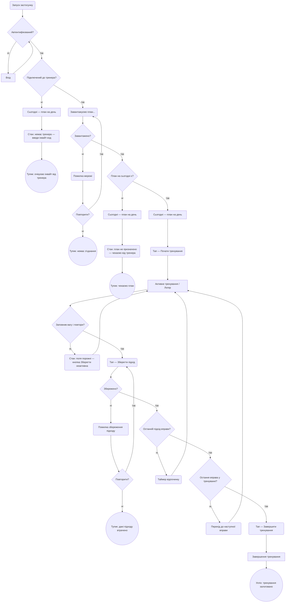
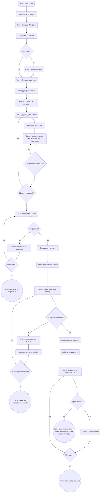
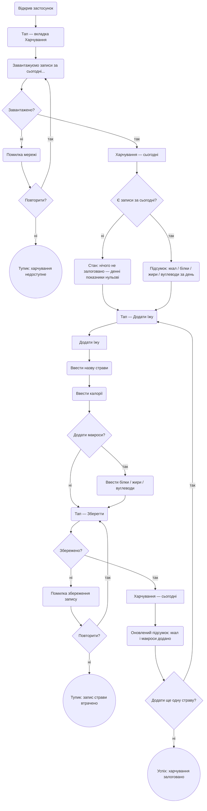
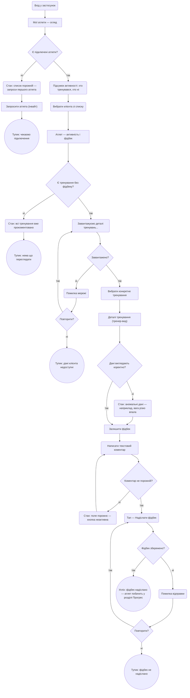

# Forge — User Flows

*Flowchart TD · Mermaid · Синтаксис GitHub-сумісний*
*Екрани у `[квадратних дужках]` — назви зі sitemap.md.*
*`{ромб}` — точка рішення. `(округлий)` — стан: loading / empty / error / дія. `((коло))` — кінець: успіх або тупик.*

---

## MAIN JOB — J3 + J4
### Знати, що тренувати сьогодні, і залогувати виконання

*Хто: атлет (Оля) · Частота: 3–5 разів на тиждень*

**Рішення у flow:**
1. **Автентифікований?** — якщо ні, блокуємо на екрані входу; після входу повертаємося
2. **Підключений до тренера?** — без тренера план ніколи не з'явиться; тупик без інвайту
3. **Завантажено?** — мережева помилка; retry або мертва гілка (немає кешу)
4. **План на сьогодні є?** — тренер підключений, але план ще не призначений; empty state
5. **Заповнив поля?** — кнопка «Зберегти» неактивна поки хоча б одне поле порожнє
6. **Збережено?** — збій синхронізації; retry або застереження про втрату підходу
7. **Останній підхід? / Остання вправа?** — цикл логування; вихід тільки після всіх вправ

**Стани:**
- **Empty / немає тренера** — атлет зареєстрований без запрошення; бачить порожній екран з інструкцією
- **Empty / план не призначено** — тренер підключений, але не поставив план на сьогодні
- **Loading** — завантаження плану при запуску; блокує UI
- **Error / мережа** — не вдалось завантажити план; пропонуємо retry
- **Error / збереження** — не вдалось зберегти підхід; retry або попередження про втрату

---

## J1 — Тренер створює і призначає план

*Хто: тренер (Максим) · Коли: початок нового тижня або новий клієнт*

**Рішення у flow:**
1. **Є програми?** — якщо порожньо, одразу пропонуємо створити нову
2. **Ще вправи? / Ще дні?** — цикл побудови програми; виходимо коли тренер готовий
3. **Збережено?** — збій при збереженні (немає мережі або validation error); retry або тупик
4. **Є підключені атлети?** — без атлета призначити нікому; відкриваємо invite flow
5. **Атлет прийняв інвайт?** — очікування on hold; продовжуємо після підключення
6. **Призначено?** — збій призначення; retry або тупик

**Стани:**
- **Empty / немає програм** — тренер ще не створив жодної програми; порожній список
- **Empty / немає атлетів** — тренер хоче призначити, але немає підключених клієнтів
- **Error / збереження програми** — не вдалось зберегти (немає мережі або помилка валідації)
- **Error / призначення** — не вдалось прив'язати програму до атлета

---

## Nutrition — Атлет логує харчування

*Хто: атлет · Коли: під час або після їжі · Частота: 3–4 рази на день*

**Рішення у flow:**
1. **Завантажено?** — кешований вид або retry; без мережі харчування недоступне
2. **Є записи за сьогодні?** — empty state якщо перший запис дня; нульові показники
3. **Додати макроси?** — лише ккал обов'язково; білки/жири/вуглеводи — опціонально
4. **Збережено?** — retry або попередження про втрату запису
5. **Додати ще?** — цикл: атлет логує кілька страв поспіль без виходу зі сценарію

**Стани:**
- **Loading** — завантаження денних записів при відкритті вкладки
- **Empty** — перший запис дня; нульові показники і CTA «Додати їжу»
- **Error / мережа** — не вдалось завантажити дані за день
- **Error / збереження** — не вдалось зберегти запис страви

---

## J2 + E2 — Тренер переглядає прогрес клієнта і залишає фідбек

*Хто: тренер (Максим) · Коли: після тренування клієнта · Частота: кілька разів на тиждень*

**Рішення у flow:**
1. **Є підключені атлети?** — empty state якщо тренер ще нікого не запросив
2. **Є тренування без фідбеку?** — якщо всі прокоментовано, тупик: нема дій
3. **Завантажено?** — мережева помилка; retry або тупик
4. **Дані коректні?** — anomaly flag: різкий спад ваги або підозрілі повтори; тренер може реагувати окремо
5. **Коментар не порожній?** — порожній фідбек заблоковано; кнопка неактивна
6. **Фідбек збережено?** — retry або застереження про невідправлений коментар

**Стани:**
- **Empty / немає атлетів** — ще немає підключених клієнтів; пропонуємо invite
- **Empty / всі прокоментовано** — нових тренувань без фідбеку немає
- **Loading** — завантаження деталей тренувань клієнта
- **Anomaly** — аномальні дані у тренуванні; тренер бачить попередження перед написанням фідбеку
- **Error / мережа** — неможливо завантажити дані клієнта
- **Error / відправка** — не вдалось надіслати фідбек; retry або попередження

---

*Новий екран додано у sitemap.md:*
`Деталі тренування (тренер-вид) [T] (J2)` — деталізований вигляд конкретного тренування атлета для тренера; точка входу до Залишити фідбек.
